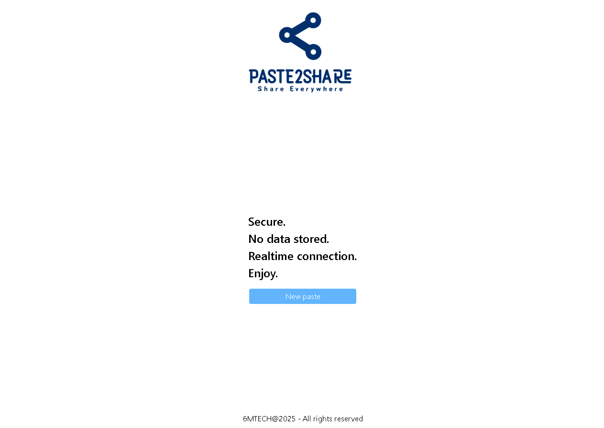

 

# Paste2Share 📋🔗

A real-time text sharing application to easily send and receive text across multiple people and devices.  
Users can create a unique session and instantly share it with others using a simple, generated URL.

This project is hosted on my personal AWS infrastructure:  
https://paste2share.danieltostes.dev/

## ✨ Features

- Real-time text synchronization across devices using WebSockets.
- One-click creation of a new “paste” session, identified by a UUID.
- Shareable links to invite others into the same live editing session.
- Clean and responsive UI built with Next.js and Tailwind CSS.

## 🧑‍💻 Technologies

- [NestJS](https://nestjs.com/) — backend API
- [Socket.io](https://socket.io/) — Bidirectional and low-latency communication Protocol
- [Next.js](https://nextjs.org/) — frontend application
- [TailwindCSS](https://tailwindcss.com/) — CSS Framework
- [TypeScript](https://www.typescriptlang.org/)
- [Docker](https://www.docker.com/) / [Podman](https://podman.io/) — containerization
- [AWS EC2](https://aws.amazon.com/ec2/) — hosting provider
- [PM2](https://pm2.keymetrics.io/) — process manager for backend/frontend
- [GitHub Actions](https://github.com/features/actions) — CI/CD automation
- [Nginx](https://www.nginx.com/) — reverse proxy server
- [Certbot](https://certbot.eff.org/) — HTTPS certificate generation and renewal

## 👤 Who is this project for?

Anyone who needs a quick and seamless way to share text between devices or collaborate in real-time using a lightweight
and accessible interface.

## ☁️ Infrastructure

The application runs on an AWS EC2 instance and uses a GitHub Actions workflow for CI/CD.

## 📦 Installation and Execution

To run this project locally, ensure you have **Docker** or **Podman** installed.

### Steps to Run

1. Clone the repository:

```bash
 git clone https://github.com/your-username/paste2share.git
 cd paste2share
```

Run the containers:

- If you're using Docker:

```
./runall-docker.sh
```

- If you're using Podman:

```
./runall-podman.sh
```

Make the script executable if needed:

```
chmod +x ./runall-{docker,podman}.sh
```

- The backend will be available at http://localhost:3001
- The frontend will be available at http://localhost:3000

📂 Project Structure

```
root
├── backend/     # NestJS backend project
├── frontend/    # Next.js frontend project
├── README.md
└── ./runall-{docker,podman}.sh
```
